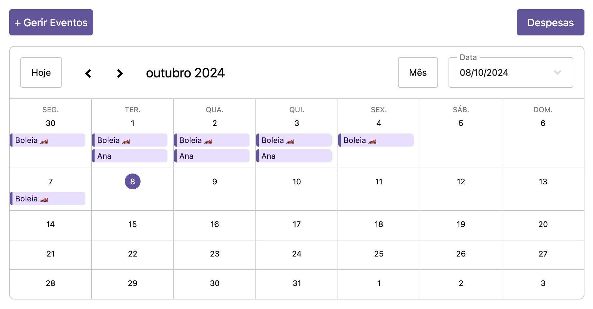
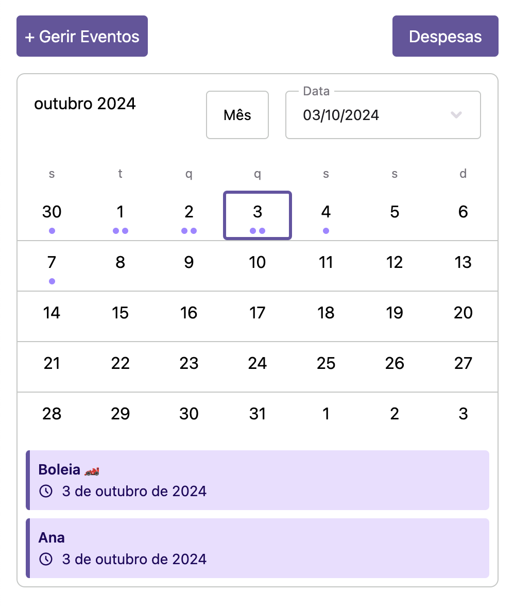

# RideShare

## Descrição do Projeto

Este projeto parece ser uma aplicação de calendário desenvolvida com Next.js e React, focada em gerir boleias para a escola. A aplicação permite definir os dias em que dás boleia a alguém e calcular o valor em euros que é dividido entre os participantes. Além disso, a aplicação fornece acesso ao valor total a receber de cada participante.

## Pontos Chave

- **Funcionalidade de Calendário**: A aplicação principal está em `src/app/page.tsx`, onde o componente `CalendarApp` é definido. Este componente utiliza várias bibliotecas da "@schedule-x" para criar e gerir um calendário.
- **Modais**: Existem dois componentes de modal, `Modal` e `ModalPrecos`, definidos em `src/app/modal.tsx` e `src/app/modalPrecos.tsx`, respetivamente. Estes modais são usados para gerir eventos e exibir despesas.
- **Cálculo de Despesas**: Nos dias em que dás boleia, a aplicação calcula o valor em euros que é dividido entre os participantes, permitindo visualizar quanto cada um deve pagar e o total a receber.
- **Persistência de Dados**: Os eventos são armazenados no `localStorage` do navegador, permitindo que os dados persistam entre sessões.
- **Estilização**: O projeto utiliza Tailwind CSS para a estilização, conforme configurado em `tailwind.config.js` e `src/app/globals.css`.

Portanto, o objetivo principal do projeto é fornecer uma interface de calendário interativa para gerir boleias, calcular e dividir despesas entre os participantes, e visualizar os valores a receber.

## Instruções de Utilização

1. **Clone o Repositório**:
    ```bash
    git clone https://github.com/JotaBarbosaDev/RideShare.git
    cd RideShare
    ```

2. **Instale as Dependências**:
    ```bash
    npm install
    ```

3. **Inicie o Servidor de Desenvolvimento**:
    ```bash
    npm run dev
    ```

4. **Acesse a Aplicação**:
    Abra o navegador e vá para `http://localhost:3000`.

5. **Utilize a Aplicação**:
    - Adicione eventos ao calendário para os dias em que dará boleia.
    - Utilize os modais para gerenciar eventos e visualizar despesas.
    - Verifique o valor total a receber de cada participante.

6. **Build para Produção**:
    ```bash
    npm run build
    ```

7. **Inicie a Aplicação em Produção**:
    ```bash
    npm start
    ```

8. **Configuração Adicional**:
    - Certifique-se de que o `localStorage` está habilitado no navegador para persistência de dados.
    - Personalize a estilização conforme necessário editando `tailwind.config.js` e `src/app/globals.css`.

## Contribuição

Se deseja contribuir para este projeto, por favor, faça um fork do repositório e envie um pull request com suas alterações.

## Capturas de Tela



